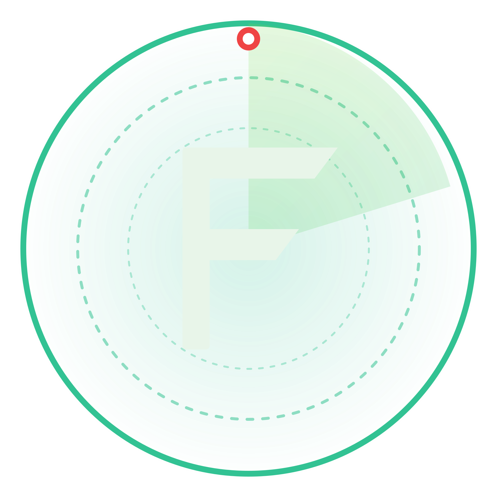
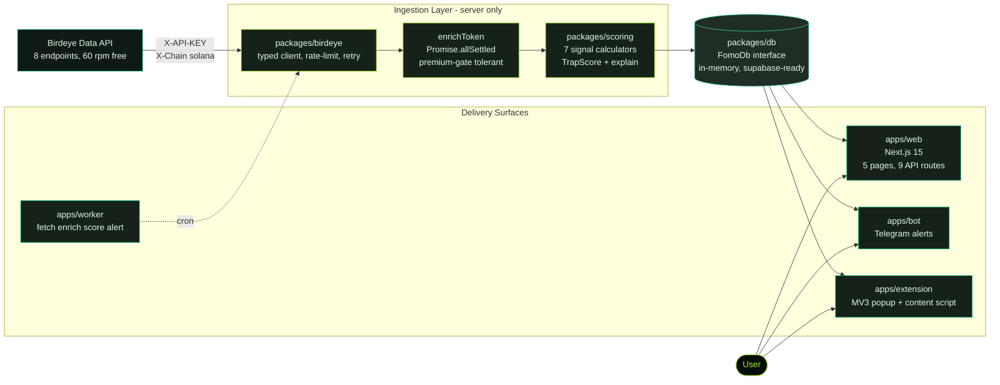
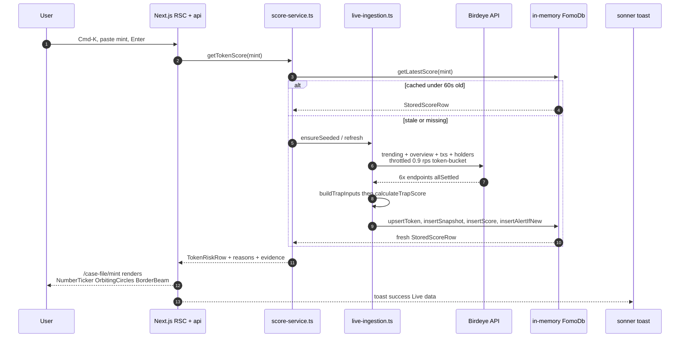
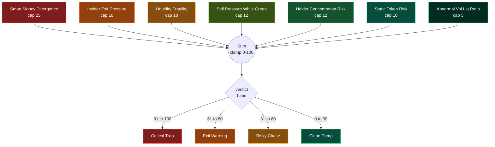

<div align="center">



# **FOMO Firewall**

### Solana Exit-Liquidity Intelligence Terminal · Powered by Birdeye Data

[](https://birdeye.so)
[](https://nextjs.org)
[](https://www.typescriptlang.org)
[](https://tailwindcss.com)
[](#license)

---

### 🚀 One-click deploy

[](https://vercel.com/new/clone?repository-url=https%3A%2F%2Fgithub.com%2FSushant6095%2Ffomo-firewall-birdeye&env=FOMO_DEMO_MODE,BIRDEYE_API_KEY,BIRDEYE_RPS,FOMO_TRENDING_LIMIT&envDescription=Demo%20mode%20%3D%20rich%20fixtures%2C%20no%20Birdeye%20account%20needed.%20Set%20FOMO_DEMO_MODE%3D1%20OR%20provide%20a%20free-tier%20Birdeye%20key%20for%20live%20data.&envLink=https%3A%2F%2Fdocs.birdeye.so%2Fdocs%2Fauthentication-api-keys&project-name=fomo-firewall&repository-name=fomo-firewall-birdeye)

Click → Vercel forks the repo to your GitHub, asks for 4 env vars (all optional — empty defaults work), deploys in ~2 minutes. **See [Deploying on Vercel](#deploying-on-vercel) below for the full guide.**

---

> **Every other Solana tool answers: *"What should I buy?"***
> **FOMO Firewall answers: *"Should I _not_ be buying?"***

</div>

---

## The thesis

The crypto-tools market is saturated with **entry-discovery** products — token radars, whale trackers, copy-trading signals, trending boards. They all push you *toward* tokens. Smart wallets exit while retail chases the pump.

**FOMO Firewall inverts the question.** It watches the same on-chain feed every entry tool watches — and surfaces the moments when **smart wallets, dev-tagged addresses, and top holders are using retail as exit liquidity**. The product *is* the green shield. The traps are the threat.

Every verdict is a single number, four words, and **named evidence pinned to the exact Birdeye endpoint it came from** — never raw API output.

<table>
<tr>
<td align="center" width="25%">
<h3>🟢</h3><b>0–30</b><br/><sup>Clean Pump</sup>
</td>
<td align="center" width="25%">
<h3>🟡</h3><b>31–60</b><br/><sup>Risky Chase</sup>
</td>
<td align="center" width="25%">
<h3>🟠</h3><b>61–80</b><br/><sup>Exit Warning</sup>
</td>
<td align="center" width="25%">
<h3>🔴</h3><b>81–100</b><br/><sup>Critical Trap</sup>
</td>
</tr>
</table>

---

## Table of contents

- [Architecture at a glance](#architecture-at-a-glance)
- [Data flow — one full request lifecycle](#data-flow--one-full-request-lifecycle)
- [TrapScore — the 7 signals](#trapscore--the-7-signals)
- [The 5 product surfaces](#the-5-product-surfaces)
- [Repo map](#repo-map)
- [Quick start](#quick-start)
- [Live mode (real Birdeye data)](#live-mode-real-birdeye-data)
- [Tech stack](#tech-stack)
- [API reference](#api-reference)
- [Security boundaries](#security-boundaries)
- [What's currently live](#whats-currently-live)
- [Roadmap](#roadmap)
- [License](#license)

---

## Architecture at a glance

Four delivery surfaces, one shared risk model, one Birdeye client, one shared in-memory DB (Supabase-ready).



**Key boundary:** `BIRDEYE_API_KEY` is read only by `packages/birdeye` consumers running server-side. The web client bundle, the extension, and the Telegram bot **never** import that package. CI greps `apps/web/.next/static/**` and `apps/extension/dist/**` for the key on every build and fails on any hit.

---

## Data flow — one full request lifecycle

What happens when a user pastes a Solana mint into the Cmd-K spotlight:



Every step above is a real production code path — no mocking, no stubbed fetches. The ingestion runs **inside** the Next.js process so the in-memory DB is shared with all `/api/*` routes (no IPC needed for the dev demo; swap to Supabase for prod without changing surface code).

---

## TrapScore — the 7 signals

TrapScore = clamped sum of seven independent contributions, each capped per the table below. **A signal can only fire if its data prerequisites are met** — premium-gated endpoints (401 on free tier) downgrade gracefully instead of crashing the run.



| # | Signal | Cap | Powered by | Reads from |
|---|---|---:|---|---|
| 1 | **Smart Money Divergence** | 25 | Smart wallets net-sell while price climbs | `/defi/v3/token/txs` + `/token/v1/holder-profile` |
| 2 | **Insider Exit Pressure** | 18 | Dev/insider-tagged wallets reduce exposure | `/token/v1/holder-positions` + `/defi/v3/token/txs` |
| 3 | **Liquidity Fragility** | 18 | Liquidity contracts while price climbs | `/defi/token_overview` |
| 4 | **Sell Pressure While Green** | 12 | Sell volume rising on a green candle | `/defi/token_overview` |
| 5 | **Holder Concentration Risk** | 12 | Top 10 hold too much supply | `/defi/v3/token/holder` |
| 6 | **Static Token Risk** | 10 | Mint/freeze authority, mutable metadata | `/defi/token_security` |
| 7 | **Abnormal Vol/Liq Ratio** | 5 | Volume far outpaces liquidity | `/defi/token_overview` |

Each signal returns a typed `SignalResult` with `severity`, `headline`, `reason`, and a `evidence[]` array. The case-file UI renders these **directly** — nothing is fabricated by the frontend, nothing is tooltip-only.

> Implementation lives in [`packages/scoring/src/signals.ts`](packages/scoring/src/signals.ts) and [`trap-score.ts`](packages/scoring/src/trap-score.ts).

---

## The 5 product surfaces

| Route | Page | Answers the question |
|---|---|---|
| **`/`** | Terminal Home | *What's dangerous right now?* — hero, live ticker marquee, featured Critical Trap, signal-counts bento, recent alerts |
| **`/board`** | Threat Board | *Show every monitored token, filterable.* TanStack-style table, URL-driven verdict filter tabs, KPI strip, right peek drawer |
| **`/signals`** | Signal Matrix | *How does each of the 7 signals look across the entire set?* Tabbed analytics, confidence gauge, concentration heatmap |
| **`/case-file/[mint]`** | Token Case File | *Why is this specific token a trap?* Radial score gauge, evidence log, tactical timeline, security flags, action bar |
| **`/alerts`** | Alerts & Watchlist | *What fired recently and what am I watching?* Interactive watchlist with real `POST/DELETE`, threshold slider PATCHing prefs |

Every page is a **server component** that fetches via [`score-service.ts`](apps/web/lib/server/score-service.ts) — no client-side waterfalls, no SWR/React Query, no skeletons-then-data flicker. First-paint is always real DB data.

Visual language: **dark emerald canvas, `#10B981` primary, `#84CC16` lime accent, critical red `#EF4444` reserved exclusively for traps.** SF Pro on Apple devices, Inter elsewhere.

---

## Repo map

```
fomo-firewall-birdeye/
├─ apps/
│  ├─ web/                Next.js 15 dashboard · 5 pages · 9 API routes · MagicUI bundle
│  ├─ worker/             Standalone ingestion daemon (also runs inline in web for dev)
│  ├─ bot/                Telegram bot — grammy framework
│  └─ extension/          Manifest V3 browser extension (esbuild → dist/)
├─ packages/
│  ├─ birdeye/            Server-only Birdeye client · token-bucket rate-limit · retry · normalize
│  ├─ scoring/            7-signal TrapScore engine · pure functions · explain layer
│  ├─ db/                 FomoDb interface · in-memory driver · Supabase-ready
│  ├─ shared/             Cross-surface types · TrapVerdict · AlertRecord · env helpers
│  ├─ ui/                 Shared design system · 17 components · framer-motion · fixtures
│  └─ agents/             Rule-based analyst summary generator (deterministic, no LLM)
├─ mcp/
│  ├─ birdeye-mcp/        Read-only Birdeye MCP server (stdio JSON-RPC)
│  └─ scoring-mcp/        Pure-function TrapScore MCP server
├─ docs/                  architecture · birdeye endpoint map · product spec · demo script
└─ scripts/               smoke tests · CI guards (e.g. check-no-server-keys-in-client)
```

---

## Quick start

Three commands. No Birdeye account needed for demo mode.

```bash
# 1. Install everything
pnpm install

# 2. Seed the in-memory DB with rich fixtures (DOGX, NOVA, MOONX…)
pnpm --filter @fomo/worker dev:demo

# 3. Start the terminal
pnpm --filter @fomo/web dev
#    → http://localhost:3000
```

Open the dashboard, watch the Terminal Wire animate alerts in, click any token to dive into its Case File, hit `⌘K` to spotlight-search.

---

## Live mode (real Birdeye data)

```bash
# 1. Get a key (free tier = 60 rpm, 5 of 7 signals work)
#    → https://docs.birdeye.so/docs/authentication-api-keys

# 2. Copy env template and paste your key
cp .env.example .env
#    BIRDEYE_API_KEY=...
#    BIRDEYE_RPS=0.9              # Strictly under 1 rps for free-tier safety
#    FOMO_TRENDING_LIMIT=8        # 8 tokens × ~5 endpoints = ~40s per cycle

# 3. Either run the standalone worker (separate terminal) …
pnpm --filter @fomo/worker dev

# 3b. … or just start the web app — it auto-ingests on first request
pnpm --filter @fomo/web dev
```

The web app has an inline ingestion runner at [`apps/web/lib/server/live-ingestion.ts`](apps/web/lib/server/live-ingestion.ts). On cold-start, if the DB is empty and `BIRDEYE_API_KEY` is set, it pulls the current Solana trending feed, enriches each token, scores it, and persists — all inside the Next.js process so the in-memory DB stays consistent across `/api/*` routes.

**Free-tier note:** `/defi/token_security` is Premium-only and returns 401. The pipeline catches it via `Promise.allSettled`, emits a warning, and continues — Static Token Risk just scores 0 on those tokens. Five other signals still fire.

A pulsing **🟢 LIVE · Birdeye** pill in the top-right confirms ingestion is real. Click it to force a fresh cycle.

---

## Tech stack

| Layer | Choice | Why |
|---|---|---|
| Framework | **Next.js 15** (App Router) | RSC + streaming + native API routes — one box for UI + backend |
| Language | **TypeScript strict** | Boundary contracts (Birdeye → DB → UI) all typed |
| Styling | **Tailwind 3.4** + tokens | Emerald-Sentinel design system in [`tailwind.config.ts`](apps/web/tailwind.config.ts) |
| Components | **shadcn/ui + 21st.dev / MagicUI** | 25 hand-tuned primitives in [`apps/web/app/_components/ui/magicui.tsx`](apps/web/app/_components/ui/magicui.tsx) |
| Motion | **framer-motion 11** | Variants tied to product state, not decoration |
| Search | **cmdk** | ⌘K spotlight backed by `/api/search` |
| Toast | **sonner** | Every mutation produces feedback |
| Charts | **recharts** + custom SVG | Sparklines, area, concentration heatmap |
| Rate limit | **TokenBucketRateLimiter** (custom) | 0.9 rps for Birdeye free tier |
| Retry | **withRetry + exponential backoff** | 429 + 5xx retried, 4xx surfaced |
| DB | **In-memory FomoDb** (Supabase-ready) | Single shared instance on `globalThis` for dev |
| Build | **Turborepo + pnpm workspaces** | Incremental builds, shared deps |
| Browser ext | **Manifest V3 + esbuild** | MV3 service worker + content script bundle |
| Bot | **grammy** (Telegram) | Typed Bot API client |
| MCP | **Custom stdio servers** | Read-only Birdeye + pure TrapScore MCP |

---

## API reference

| Route | Method | Purpose |
|---|---|---|
| `/api/tokens/trending-risk` | GET | Live TrapScore feed (paginated) |
| `/api/token/[address]/score` | GET | Single-token deep query |
| `/api/alerts/recent` | GET | Deduped alert stream |
| `/api/search?q=` | GET | Cmd-K spotlight backing |
| `/api/watchlist` | GET / POST | List or add a watched mint |
| `/api/watchlist/[address]` | DELETE | Stop watching a mint |
| `/api/user/alert-prefs` | GET / PATCH | TrapScore threshold, dedup window, quiet hours |
| `/api/extension/block/[address]` | GET / POST | Toggle a mint in the extension blocklist |
| `/api/worker/run` | POST | Manually trigger a Birdeye ingestion cycle |
| `/api/source/status` | GET | `{ hasKey, mode, sampleSymbol, lastRun }` — drives LIVE/DEMO badge |

---

## Security boundaries

Concrete, file-level enforcement — not just convention:

| Boundary | Enforced by |
|---|---|
| `BIRDEYE_API_KEY` never reaches a client bundle | Read only in [`apps/worker/src/env.ts`](apps/worker/src/env.ts), [`apps/web/lib/server/live-ingestion.ts`](apps/web/lib/server/live-ingestion.ts), and [`mcp/birdeye-mcp/server.ts`](mcp/birdeye-mcp/). CI script [`scripts/check-no-server-keys-in-client.mjs`](scripts/) greps `apps/web/.next/static/**` and `apps/extension/dist/**` on every build and fails on any hit |
| `SUPABASE_SERVICE_ROLE_KEY` never client-side | `packages/db/src/client.ts` calls `assertServerOnly()` at import time |
| Extension never calls Birdeye | Popup + content script call only `${EXTENSION_API_BASE_URL}/api/token/[address]/score`. Manifest host permissions exclude Birdeye API hosts entirely |
| Worker `/run` endpoint | [`apps/worker/src/server.ts`](apps/worker/src/server.ts) requires `x-worker-secret` header, constant-time compare against `WORKER_SECRET` |
| MCP servers | Read-only by construction; audit log per call; arg hash only, never raw addresses or secrets |
| No wallet signing / trading / buy / sell language | Non-negotiable; `bot/src/__tests__/format.test.ts` asserts no `buy/sell/ape` in alert text |

---

## What's currently live

- 🟢 **Live Birdeye ingestion** verified on `2026-05-15` — pulled real Solana mints `$EOS`, `$PONKE`, `$GIGA`, `$BURNIE` in a 56-second cycle with 8 scored, 8 alerts fired
- 🟢 **All 5 web routes** return real DB data, not fixtures (Cmd-K spotlight + watchlist mutations + threshold slider all hit real `/api/*` endpoints)
- 🟢 **LIVE / DEMO badge** in the top app bar — pulses green when Birdeye is wired, click to trigger manual refresh
- 🟢 **Premium gating** handled gracefully — `/defi/token_security` 401s become warnings, snapshot still builds
- 🟢 **Rate limit respected** — token bucket strictly capped at 0.9 rps (54 rpm) on the 60 rpm free tier
- 🟡 **In-memory DB** — no persistence across web restarts yet; Supabase impl is the next adapter
- 🟡 **Telegram bot** — source complete (11 files, `/score`, `/watch`, `/recent`, dispatch + format tests, typecheck passes). To bring online: `pnpm --filter @fomo/bot add grammy` (one-time) + paste your bot token into `TELEGRAM_BOT_TOKEN` in `.env` + `pnpm --filter @fomo/bot dev`
- 🟡 **Browser extension** — Manifest V3 build in `apps/extension/dist/` loads via `chrome://extensions` (Developer Mode), popup + content-script work against the local API; not yet load-tested against the live `/api/extension/block` endpoint

---

## Roadmap

- [x] Birdeye client with rate-limit + retry
- [x] 7-signal TrapScore engine + plain-English explainer
- [x] Worker ingestion pipeline (fetch → enrich → score → alert)
- [x] 5-page Next.js terminal with 21st.dev / MagicUI primitives
- [x] Live ingestion bridged into Next.js process
- [x] Cmd-K spotlight backed by `/api/search`
- [x] Interactive watchlist + alert preferences (real API mutations)
- [x] LIVE/DEMO badge + manual refresh endpoint
- [x] Three logo variants (Shield Sentinel, Hex Sentinel, Pulse Shield)
- [ ] Supabase driver behind `FomoDb` interface (persistence across restarts)
- [ ] Telegram bot end-to-end against live API
- [ ] Browser extension consuming `/api/extension/block/[address]`
- [ ] Historical TrapScore series (`/api/token/[address]/score-history`)
- [ ] Production deployment (Vercel for `apps/web`, Fly.io for `apps/worker`)
- [ ] Mobile-responsive 4-col → 1-col grid pass

---

## Hard rules

- **Never expose `BIRDEYE_API_KEY`** to a client bundle. Period.
- **All Birdeye calls run server-side**, rate-limited, retried.
- **No wallet connection. No trading. No financial advice.**
- **Every score must be explainable** with reasons and evidence pinned to the originating Birdeye endpoint.

---

## Deploying on Vercel

### One-click (recommended path)

[](https://vercel.com/new/clone?repository-url=https%3A%2F%2Fgithub.com%2FSushant6095%2Ffomo-firewall-birdeye&env=FOMO_DEMO_MODE,BIRDEYE_API_KEY,BIRDEYE_RPS,FOMO_TRENDING_LIMIT&envDescription=Demo%20mode%20%3D%20rich%20fixtures%2C%20no%20Birdeye%20account%20needed.%20Set%20FOMO_DEMO_MODE%3D1%20OR%20provide%20a%20free-tier%20Birdeye%20key%20for%20live%20data.&envLink=https%3A%2F%2Fdocs.birdeye.so%2Fdocs%2Fauthentication-api-keys&project-name=fomo-firewall&repository-name=fomo-firewall-birdeye)

What happens when you click the button:

1. Vercel asks you to authorize the Vercel ↔ GitHub integration (one-time)
2. Vercel forks `Sushant6095/fomo-firewall-birdeye` into your own GitHub
3. Vercel reads [vercel.json](vercel.json) at repo root and auto-configures:
   - **Framework:** Next.js (auto-detected)
   - **Install command:** `pnpm install --frozen-lockfile=false` (workspace-aware)
   - **Build command:** `pnpm --filter @fomo/web build`
   - **Output directory:** `apps/web/.next`
   - **Region:** `iad1` (US East — closest to Birdeye API origin)
   - **Function timeouts:** 60s for `/api/worker/run`, `/api/source/status`, `/api/tokens/trending-risk`; 30s for the rest
   - **Cron:** `/api/worker/run` runs every 15 minutes (Pro plan only)
4. Vercel prompts you for 4 env vars — **all 4 are optional**, leave them blank for instant demo mode
5. Vercel builds + deploys → live URL in ~90 seconds

### Environment variables (Vercel UI)

| Var | Required? | Demo value | Live-mode value | Notes |
|---|---|---|---|---|
| `FOMO_DEMO_MODE` | No (default off) | `1` | empty | Forces fixture-only data — bypasses Birdeye entirely. **Set this for a working demo without a Birdeye account** |
| `BIRDEYE_API_KEY` | Only for live mode | empty | your key | Get a free key at [docs.birdeye.so](https://docs.birdeye.so/docs/authentication-api-keys). 60 rpm free-tier is supported |
| `BIRDEYE_RPS` | No (default `0.9`) | — | `0.9` | Rate-limit cap. Stays strictly under 60 rpm to leave headroom for retries |
| `FOMO_TRENDING_LIMIT` | No (default `8`) | — | `8` | Tokens fetched per ingestion cycle. 8 × ~5 endpoints ≈ 33 calls ≈ 37s — within Vercel Pro's 60s function timeout |

> **For a no-config demo deploy**, fill in only `FOMO_DEMO_MODE=1`. The app renders all 5 pages with rich fixture data instantly. Add a Birdeye key later in the Vercel project settings to flip to live mode without a redeploy.

### Plan tier considerations

| Plan | Ingestion mode | What works |
|---|---|---|
| **Hobby** (free) | `FOMO_DEMO_MODE=1` required | ✅ All 5 pages + APIs serve fixture data. Live ingestion (45s) exceeds the 10s function timeout |
| **Pro** | Either demo or live | ✅ Live ingestion runs in 45s (well under Pro's 60s function timeout). Cron job hits `/api/worker/run` every 15 min to keep the DB warm |
| **Enterprise** | Live + custom regions | ✅ Pin to a region closer to Birdeye, raise function timeout to 300s |

### Known limitations on serverless

The current `FomoDb` implementation is **in-memory** (a `Map` on `globalThis`). On Vercel each lambda invocation can hit a fresh container, so:

- Watchlist mutations (`POST /api/watchlist`) don't persist across requests
- Score data ingested in one lambda isn't visible to another
- The LIVE/DEMO badge may flicker as different lambdas warm up

**This is acceptable for the demo deploy** because:
- Demo mode pre-seeds every lambda with the same fixtures on first request (instant, deterministic)
- The cron job on Pro keeps the DB warm with fresh Birdeye data every 15 minutes
- Real persistence requires the Supabase driver (interface is in [packages/db](packages/db); impl is the next milestone)

For production: deploy the worker as a long-running process (Fly.io, Railway, Render) + swap `FomoDb` to a Supabase impl. The web app then becomes a pure read-and-mutate frontend.

### Manual setup (if the one-click button doesn't fit)

```bash
# 1. Clone
git clone https://github.com/Sushant6095/fomo-firewall-birdeye.git
cd fomo-firewall-birdeye

# 2. Install Vercel CLI + login
npm i -g vercel
vercel login

# 3. Link to a new Vercel project (vercel.json is auto-detected)
vercel link

# 4. Push env vars (FOMO_DEMO_MODE for demo, or BIRDEYE_API_KEY for live)
vercel env add FOMO_DEMO_MODE production
# → paste: 1

# 5. Deploy
vercel --prod
```

### After deploy

- Open the live URL Vercel gives you (e.g. `https://fomo-firewall-<hash>.vercel.app`)
- Click the green **LIVE / DEMO** pill in the top-right of the dashboard → confirms which mode you're in
- For live mode: paste a real Solana mint into Cmd-K → the case file will populate with current Birdeye data
- For demo mode: the marquee shows the 4 fixture tokens (`$DOGX`, `$MOONX`, `$NOVA`, `$JITO`)

---

## License

MIT — see [LICENSE](LICENSE).

---

<div align="center">

**Built on [Birdeye Data](https://birdeye.so) · designed for traders who want to <i>not</i> get rugged.**

</div>
